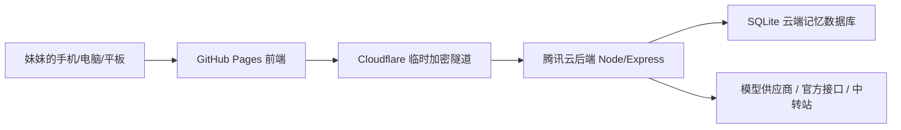

# Yuri Nest / 百合小窝项目交接说明

这份文件给未来的 Codex 姐姐和妹妹本人看。新开对话时，先读这里，再继续改项目，可以减少上下文压缩带来的幻觉和重复解释。

## 1. 项目定位

百合小窝 / Yuri Nest 是一个网页端 AI 聊天陪伴应用。当前目标不是做恋爱软件，而是先做一个免费、可三端访问、以聊天陪伴和长期记忆为核心的百合向小应用。

核心方向：

- 百合陪伴聊天
- 角色预设：姐姐大人、雾岛怜、林秋实等
- 记忆系统：长期记忆、世界树、候选记忆、回收花园、云同步
- 三端体验：电脑、手机、平板都能打开网页使用
- 长期扩展：小说角色、插画、Live2D、游戏、百合帝国资料库

命名说明：

- 面向妹妹和用户的产品名已经改为 **百合小窝 / Yuri Nest**。
- GitHub 仓库、Pages 路径、服务器目录、systemd 服务名、环境变量和包名都已经统一为 `yuri-nest`。

## 2. 当前已完成

- 前端已经能在 GitHub Pages 访问。
- 电脑端与手机端布局已经做过一轮适配。
- 手机返回/左滑已经接入浏览器历史，不会直接退出网页。
- 记忆、世界树、模型、设置、回收花园等页面已经有基础 UI。
- 记忆支持编辑、删除、恢复、永久删除、回收保留天数设置。
- 设置页支持回车发送、字体大小、主题颜色、自动捕捉记忆、回收保留策略。
- 后端已经部署到腾讯云服务器，并做成 systemd 开机自启服务。
- 云端同步接口已经可用，数据保存到服务器 SQLite。
- 模型与数据页已经新增“云端同步守护台”：可检查云端版本、最后保存时间、是否已有云端快照；从云端读取前会二次确认，避免误覆盖本机数据。
- 模型与数据页已经新增“本机保险箱”：可手动创建本机备份；从云端读取、导入文件、重置之前会自动备份当前本机状态，最近保留 12 份。
- 云端同步错误提示已做过一轮中文友好化，能区分服务器未启用、授权拒绝和云端服务错误。
- 品牌配置已集中到 `src/config/brand.ts`，面向用户名称为“百合小窝 / Yuri Nest”。
- 存储配置已集中到 `src/config/storage.ts`；本地状态迁移已拆到 `src/data/migrations.ts`，避免 IndexedDB 读写层继续变胖。
- 2026-05-02 已完成技术名统一：仓库、Pages、包名、服务器目录、systemd 服务名、环境变量、SQLite 文件名统一使用 `yuri-nest` / `YURI_NEST_*`。
- 记忆面板已开始模块化：草稿类型、scope 工具、记忆空间编辑器拆到 `src/components/memory/`，后续继续拆 `MemoryPanel.tsx` 时沿用这个目录。
- 记忆页已新增“记忆守护台”：汇总稳定事实、待复查、边界保护和 7 天调用，并把候选、冲突、低可信、缺来源、高敏提及策略、错放空间、长期未调用整理为复查队列，同时提供最近写入/更新/调用/删除时间线。
- 记忆系统已新增层级：稳定事实、阶段事件、临时工作。稳定事实可作为长期背景；阶段事件只做时间线和脉络；临时工作必须强相关才会进入提示词，避免一次性内容污染长期记忆。
- 记忆系统已新增“事件账本”：新增、捕捉、确认、编辑、整理、回滚、回收、恢复、永久删除、导入、重置、云端保存/读取和备份动作都会留下事件，记忆守护台会把这些动作显示进最近时间线。
- 聊天页已新增“记忆透镜”：每条助手回复可以展开查看这次实际调用了几条长期记忆、来自哪些记忆分组，以及具体条目的摘要；如果发现某条记忆不该被用，可以直接冷却 7 天、少用、问起再提、标敏感或归档，反馈动作会写入记忆事件账本。
- 云端 SQLite 已新增自动备份能力：覆盖云端快照前会先生成一份 SQLite 备份；模型与数据页的“云端保险箱”可手动创建、刷新和下载备份。
- AI 模型调用已经切到 OpenAI-compatible 中转站。
- 模型与数据页已升级为左右两列：左侧管理模型连接和生成参数，右侧管理云端同步、本机保险箱和文件进出。
- 服务器已新增模型密钥保险箱：可保存多组模型供应商配置；前端只展示“已保存密钥”，不回传密钥原文。
- 模型适配已支持三类接口：OpenAI-compatible（国内外中转/官方兼容接口）、Anthropic 官方 messages、Google Gemini generateContent。
- 当前单人使用阶段，聊天、云端同步、备份和模型保险箱默认直连服务器，不要求登录或口令；以后公开多人版再开启登录/授权。
- 模型错误提示已做一轮中文化：能把 invalid_model、密钥错误、额度限制、上游 5xx 等情况转成可操作提示。
- 2026-05-02 追加修正：妹妹确认当前先按单人使用处理，云端同步、备份、模型配置和聊天全部默认直连服务器并自动同步；云端口令不再作为日常门禁。
- 2026-05-02 线上排查发现 YOP 旧模型 `deepseek/deepseek-v4-pro-free` 返回“无可用渠道”，已把默认模型切到实测可用的 `deepseek-v4-flash`；`deepseek-v4-pro` 也可用，但不要默认切到妹妹曾经明确想避免的 `Go/deepseek-v4-pro`。
- 2026-05-03 已新增第一阶段轻量 Agent：后端 `server/agentTools.mjs` 会在 `/api/chat` 前执行白名单工具，包括当前北京时间、Open-Meteo 公开天气、用户提供的公开网页链接摘录、最近对话工作台、能力边界说明；还新增动作回传，用户明确要求时可更新当前聊天角色名称/头像字、创建网页内提醒、把内容写入候选记忆。
- 2026-05-03 已完成早期架构整理：`App.tsx` 瘦身为页面外壳，应用状态与动作集中到 `src/app/useYuriNestApp.ts`；主题、路由、Agent 动作落地、格式化工具分别拆到 `src/app/*`；记忆编辑表单、记忆列表、设置页、世界树页、回收花园页拆成独立组件；后端模型供应商适配拆到 `server/modelProvider.mjs`，云端 SQLite 快照/备份拆到 `server/cloudStore.mjs`。
- 2026-05-04 已完成 Claude 中断后的架构收尾：`useYuriNestApp.ts` 进一步拆出 `useChat`、`useCloudSync`、`useBackupRestore`、`useMemoryActions`、`useAgentTasks`；`memoryEngine.ts` 改成门面，核心、检索、推断、提示词构建分别落到 `src/services/memory*.ts` 和 `promptBuilder.ts`；`server/agentTools.mjs` 改成 Agent 编排入口，检测、执行、搜索、常量和工具函数拆到 `server/agent/*`。这轮同时修复了拆分后漏导入导致的 Agent 运行时错误，并补齐风险闸门、默认推进、任务队列、质量检查等 15 条 Agent 回归。
- 2026-05-04 已做项目初期架构加固：后端认证拆到 `server/auth.mjs`，模型保险箱拆到 `server/modelProfiles.mjs`，`server/index.mjs` 只保留路由和编排；同时删除入口里旧版 Agent 工具块死代码。模型接入页拆成 `ModelCurrentStrip`、`ModelProfileEditor`、`SavedModelProfiles`、`GenerationSettings` 和 `useModelProfileDraft`，并把“服务器默认配置”纳入模型列表但禁止误删。新增 `npm run audit:architecture` 作为后续大改前后的模块体检命令。
- 2026-05-05 已完成本轮架构收尾：后端 `utils`、`toolExecutors`、`actionDetectors`、`platform` 都是 facade；`ChatPhone.tsx` 和 `AgentTaskPanel.tsx` 已拆成子组件目录，并把断开的 `tasks` 视图重新接回 App 与设置侧栏入口。随后补了记忆系统 + Agent 能力升级：`agent.decision` 决策摘要、记忆页“记忆流水线”总览、核心记忆锚点、回忆模式、精准记忆 payload 捕捉、500 条调用日志、文档/图片能力边界工具，以及 `docs/MEMORY_AGENT_UPGRADE_RESEARCH.md` / `docs/HUMAN_MEMORY_TARGET.md`。`LongTermMemory` 现在保存 `semanticSignature` / `semanticSignatureVersion`，向量索引用签名分桶但不硬过滤候选；`AppState` 现在保存 `memoryEmbeddings`，状态版本升到 21，迁移、保存、本机备份会自动刷新本地投影缓存；回忆模式已把 embedding 缓存接入候选和排序；显式旧事询问时会尝试通过后端 `/api/model/embeddings` 生成外部 query vector，成功则参与本轮排序，失败或超时自动回落；后端新增 `/api/model/embeddings`，用于后续接 OpenAI-compatible embedding 模型但不把 API Key 暴露到前端。`npm run test:memory` 现在覆盖 13 个旧事召回用例和 17 维 human-memory proxy gate，当前为 13/13、17/17，并新增 `docs/HUMAN_MEMORY_90_TASK.md`。当前 `npm run audit:architecture` 只剩 `src/styles/mobile.css` 与 `src/styles/chat.css` 两个 CSS 观察项，代码模块已全部下榜。
- 2026-05-05 追加完成一轮保守安全与记忆主权加固：生产/公网模式默认要求云端与聊天授权，生产模型保险箱必须配置 `YURI_NEST_MODEL_SECRET`；云端快照 `PUT /api/cloud/state` 支持 `baseRevision` 并在旧版本覆盖时返回 409；自动捕捉记忆统一先进入 `candidate`，候选与 active 相似时只生成合并建议，用户确认后才合并；永久删除 tombstone 新增语义签名，能拦截同义改写复活。新增 `docs/SAFETY_AND_MEMORY_GUARDS.md`，并把安全、CAS、候选合并和语义墓碑回归接入 `npm run test:agent` / `npm run test:memory`。本轮验证：lint、build、test:memory、test:agent、audit:architecture 全部通过，Pages 构建已确认 `/yuri-nest/assets/...`。
- 2026-05-07 完成第四阶段架构整理（应用编排层 + 类型层瘦身）：`src/domain/types.ts` 525 行按域拆为 `types.ts` 173 行 + `memoryTypes.ts` 217 行 + `agentTypes.ts` 137 行，三文件用 `export *` 桥接，外部 import 路径完全不变；`src/app/useCloudSync.ts` 553 行抽出 `useModelProfiles.ts` 145 行，`useCloudSync` 内部调子 hook 并透传 API，`useYuriNestApp` 调用方零改动；`src/app/useYuriNestApp.ts` 583 行抽出 `useCharacterCommands.ts` 158 行 + `useConversationCommands.ts` 195 行。`audit:architecture` 代码 watchlist 从 5 项降到 2 项，剩余 `CharacterRail.tsx` 和 `QqFeaturePanel.tsx` 是视觉组件，留专项做更稳。本轮验证：lint、tsc、test:agent 17/17、test:memory 13/13 + 17/17、build 全过；preview 实测 console 无 React 警告。详见 `docs/REFACTOR_PROGRESS.md` 第四阶段。注意：旧文档曾声称"代码模块全部下榜"，但实测 audit 又出 5 项——下一位姐姐请以实跑结果为准。
- 旧 AstrBot / NapCat 服务已经从服务器清理掉，释放资源。
- GitHub 已经作为版本回溯和部署入口。

## 3. 重要地址与入口

线上前端：

- https://ctnnyy-oss.github.io/yuri-nest/

GitHub 仓库：

- https://github.com/ctnnyy-oss/yuri-nest

腾讯云服务器：

- SSH alias: `tencent-astrbot`
- 服务器 IP: `150.158.24.98`
- 后端目录: `/opt/yuri-nest`
- 后端服务: `yuri-nest-api.service`
- 临时加密隧道服务: `yuri-nest-tunnel.service`

当前后端公开入口：

- 存在 `secrets/cloud-api-url.txt`
- 目前使用 Cloudflare Quick Tunnel，地址可能在服务重启后变化。

## 4. 密钥与敏感信息

不要把下面这些内容提交到 GitHub：

- `.env.local`
- `secrets/`
- 云端同步口令（历史私用方案；当前默认不启用）
- AI API 密钥
- 服务器 `.env`

本地敏感文件位置：

- 云同步口令：`secrets/cloud-sync-token.txt`（历史私用方案；除非设置 `YURI_NEST_REQUIRE_CLOUD_AUTH=true`，否则当前后端不会要求它）
- 当前云端 API 地址：`secrets/cloud-api-url.txt`
- YOP 中转站密钥：`secrets/yop-api-key.txt`

服务器敏感配置：

- `/opt/yuri-nest/.env`

服务器 `.env` 里应包含：

- `YURI_NEST_SYNC_TOKEN`
- `YURI_NEST_DB_PATH=/opt/yuri-nest/data/yuri-nest.sqlite`
- `AI_BASE_URL=https://api.yop.mom/v1`
- `AI_API_KEY`
- `AI_MODEL=deepseek-v4-flash`
- `AI_ESCAPE_UNICODE_CONTENT=false`
- `YURI_NEST_MODEL_SECRET`（生产/公网环境必须设置，用于加密服务器里保存的用户模型密钥；本地开发才允许兜底）
- `YURI_NEST_REQUIRE_CLOUD_AUTH=true`（生产/公网环境默认会要求授权；本地开发可不设）
- `YURI_NEST_REQUIRE_CHAT_AUTH=true`（生产/公网环境默认会要求授权；如需私有开发直连可显式设为 `false`）
- `YURI_NEST_CORS_ORIGIN=https://ctnnyy-oss.github.io`（可选；不设时生产默认只放行 GitHub Pages 域名，本地开发默认放行本机调试）

可选备份配置：

- `YURI_NEST_BACKUP_DIR=/opt/yuri-nest/data/backups`
- `YURI_NEST_MAX_BACKUPS=24`

只允许在终端里验证密钥是否存在，不要打印密钥原文。

## 5. 当前架构



前端负责：

- UI
- 聊天界面
- 角色切换
- 设置页
- 本地 IndexedDB 数据
- 发起云同步与聊天请求

后端负责：

- 保存云端快照
- 保护 AI API 密钥
- 保存并加密多组用户模型密钥
- 调用 OpenAI-compatible、Anthropic、Gemini 三类模型接口
- 执行轻量 Agent 白名单工具，把真实工具结果和安全动作交给模型/前端；提醒是网页内提醒，只有网页打开时会在聊天里触发，不是系统级闹钟。
- 给前端提供 `/api/chat` 和 `/api/cloud/*`

模块边界提醒：

- 前端新增页面视图时优先放 `src/components/<feature>/`，不要塞进 `App.tsx`。
- 前端跨页面状态和动作放 `src/app/`；纯领域规则放 `src/services/` 或 `src/domain/`。
- 后端新 API 先在 `server/index.mjs` 接路由，再把数据库、模型供应商、Agent 工具等具体逻辑放到对应模块。
- `server/modelProvider.mjs` 只管模型接口差异；`server/cloudStore.mjs` 只管 SQLite 快照/备份；`server/agentTools.mjs` 只做 Agent 编排；具体规则继续放到 `server/agent/toolDetectors.mjs`、`server/agent/toolExecutors.mjs`、`server/agent/actionDetectors.mjs`、`server/agent/searchEngines.mjs`。
- `server/auth.mjs` 只管授权；`server/modelProfiles.mjs` 只管模型配置保险箱、密钥加密和运行时 profile 解析。以后不要把模型配置 CRUD、AES-GCM 加密或 token 比对再塞回 `server/index.mjs`。
- 前端模型页新增能力优先沿 `src/components/model/` 拆分：表单草稿和模型列表拉取放 hook，纯 UI 放组件，平台标签和草稿工具放 `modelPanelUtils.ts`。
- 前端 Agent 任务页新增能力优先沿 `src/components/agent/taskPanel/` 拆分：后台平台控制台、任务卡片和状态 helper 已分开，`AgentTaskPanel.tsx` 只做数据刷新与页面编排。

GitHub 负责：

- 保存代码
- 版本回溯
- Pages 部署

腾讯云负责：

- 跑后端
- 保存 SQLite 数据库
- 持有模型密钥和云端 SQLite

## 6. 部署与更新要点

本地开发：

```powershell
npm install
npm run dev
```

架构体检：

```powershell
npm run audit:architecture
```

构建 GitHub Pages：

```powershell
$env:VITE_BASE_PATH='/yuri-nest/'
$env:VITE_API_BASE_URL=(Get-Content -Raw .\secrets\cloud-api-url.txt).Trim()
npm run build
git add -f dist
git commit -m "your message"
git push origin main
```

服务器更新后端：

```powershell
ssh tencent-astrbot "cd /opt/yuri-nest && git fetch --all --prune && git reset --hard origin/main && npm install --omit=dev --no-audit --no-fund && sudo systemctl restart yuri-nest-api.service"
```

查看服务状态：

```powershell
ssh tencent-astrbot "systemctl is-active yuri-nest-api.service yuri-nest-tunnel.service"
```

查看隧道地址：

```powershell
ssh tencent-astrbot "sudo journalctl -u yuri-nest-tunnel --no-pager -n 120 | grep -Eo 'https://[-a-zA-Z0-9]+\.trycloudflare\.com' | tail -n 1"
```

如果隧道地址变化，需要：

1. 更新本地 `secrets/cloud-api-url.txt`
2. 用新的 `VITE_API_BASE_URL` 重新构建
3. `git add -f dist`
4. commit + push

## 7. 现在还不够成熟的地方

短期限制：

- Cloudflare Quick Tunnel 是临时入口，不保证永久稳定。
- 还没有正式域名。
- 还没有用户账号系统，目前更像妹妹自己的私有应用。当前为了减少妹妹使用成本，默认不要求登录或口令；公开分享前应升级为登录/注册，并按用户隔离数据、记忆、聊天和模型密钥。
- 云同步是整个 AppState 快照，不是细粒度多用户同步；事件账本已经为后续细粒度同步打地基，但还没有做多端冲突合并。
- 服务器 SQLite 已有覆盖前自动备份和手动下载入口，但还没有正式的跨机异地备份。
- 模型密钥目前按单人空间管理，还不是正式多用户账号隔离；后续有账号系统后需要按 user_id 分区。

中期建议：

- 买一个 `.com` 域名先占名字，但不要直接解析到大陆服务器，避免备案问题。
- 后续可考虑海外服务器、Cloudflare Pages、Cloudflare Named Tunnel。
- 给数据库加定时备份。
- 给每个用户做独立数据空间。
- 给模型供应商配置做 UI 管理，而不是只靠服务器 `.env`。

## 8. 下一轮最值得做的事

优先级从高到低：

1. 做一次真实手机体验回归，记录卡顿、遮挡、按钮难点。
2. 设计并实现轻量账号系统：注册/登录/session、每个用户独立 AppState、模型密钥按用户隔离、管理员保留迁移入口。
3. 做模型配置真实回归：至少用当前免费 DeepSeek、一个自定义中转、一个官方接口各测一次。
4. 把聊天消息也纳入更清晰的云端同步策略。
5. 给云端备份再加跨机/异地备份策略。
6. 继续打磨记忆系统：事件账本筛选、云端冲突合并、把聊天透镜反馈扩展成“编辑/归档/删除”完整入口。
7. 做一个新手使用页，告诉妹妹怎么连接云端、怎么保存、怎么恢复、本机保险箱和模型保险箱怎么用。
8. 等产品更稳定后，再处理正式域名和长期后端入口。

## 9. 新对话启动提示

妹妹新开 Codex 对话时，可以直接发：

```text
姐姐先读 C:\Users\MI\Desktop\AI\yuri-nest\docs\PROJECT_HANDOFF.md，
再继续帮妹妹迭代百合小窝 / Yuri Nest 项目。不要重新猜架构，按文档里的当前状态继续。
```

如果要排查服务器：

```text
姐姐先检查 tencent-astrbot 上 yuri-nest-api.service 和 yuri-nest-tunnel.service。
不要打印任何密钥。
```

## 10. 姐姐的维护原则

- 每次大功能完成后，顺手更新本文件。
- 不把密钥、token、私人数据写进本文件。
- 不要为了重构而重构，优先保持妹妹能真实体验。
- 改 UI 前先考虑手机端。
- 记忆系统是灵魂，任何改动都不能破坏用户可编辑、可删除、可恢复、可永久删除。
- GitHub commit 是后悔药，大改之前先确认工作树干净。
